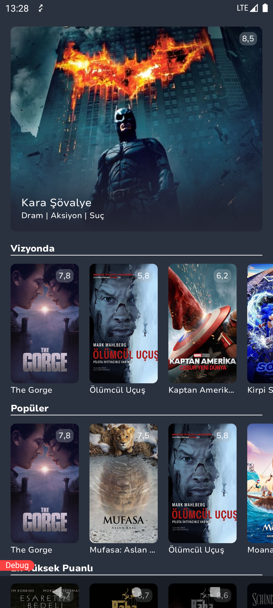
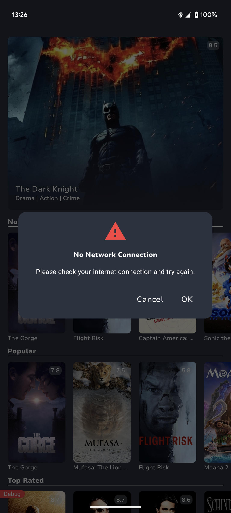
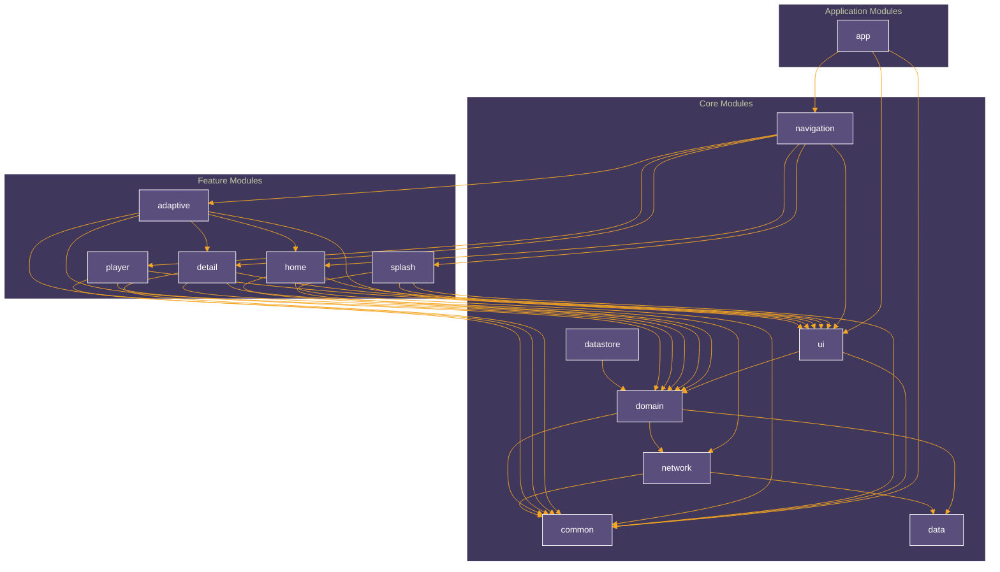

<a name="readme-top"></a>
<div align="center">

# MovieCatalog

</div>
<p align="center">
  <a href="https://android-arsenal.com/api?level=24" target="_blank"></a>
  <a></a>
  <a></a>
  <a></a>
</p>

<p align="center">
    <a href="https://github.com/enesky/MovieCatalog/blob/develop/.github/workflows/main.yml" target="_blank"></a>
    <a href="https://maestro.mobile.dev/" target="_blank"></a>
</p>

## Screenshots

### Home Screen
|                                 Dark Theme                                  |                                  Light Theme                                  |
|:---------------------------------------------------------------------------:|:-----------------------------------------------------------------------------:|
|  |  |

### Details Screen
|                                    Dark Theme                                     |                                     Light Theme                                     |
|:---------------------------------------------------------------------------------:|:-----------------------------------------------------------------------------------:|
|  |  |

### Adaptive Screen
|                                     Dark Theme                                      |                                      Light Theme                                      |
|:-----------------------------------------------------------------------------------:|:-------------------------------------------------------------------------------------:|
|  |  |

### Player Screen
|                                   Dark Theme                                    |                                    Light Theme                                    |                                         Landscape                                         |
|:-------------------------------------------------------------------------------:|:---------------------------------------------------------------------------------:|:-----------------------------------------------------------------------------------------:|
|  |  |  |

### Additional Features
|                                  Localization                                   |                                 Network Connectivity Listener                                 |
|:-------------------------------------------------------------------------------:|:---------------------------------------------------------------------------------------------:|
|  |  |


## Features

- <a href="https://kotlinlang.org/" target="_blank">Kotlin</a> based, Compose for UI Toolkit, <a href="https://github.com/Kotlin/kotlinx.coroutines" target="_blank">Coroutines</a> + <a href="https://kotlin.github.io/kotlinx.coroutines/kotlinx-coroutines-core/kotlinx.coroutines.flow/" target="_blank">Flow</a> for asynchronous jobs.

- Jetpack
    - <a href="https://developer.android.com/jetpack/compose" target="_blank">Compose</a>: Android’s recommended modern toolkit for building native UI.
    - <a href="https://developer.android.com/topic/libraries/architecture" target="_blank">Android Architecture Components</a>: Collection of libraries that help you design robust, testable, and maintainable apps.
        - <a href="https://developer.android.com/kotlin/coroutines" target="_blank">Coroutines</a>: Concurrency design pattern that you can use on Android to simplify code that executes asynchronously.
        - <a href="https://developer.android.com/jetpack/androidx/releases/hilt" target="_blank">Hilt Dependency Injection</a>: Hilt is a dependency injection library for Android that reduces the boilerplate of doing manual dependency injection in your project.
        - <a href="https://developer.android.com/kotlin/flow/stateflow-and-sharedflow" target="_blank">Stateflow</a>: StateFlow is a state-holder observable flow that emits the current and new state updates to its collectors.
        - <a href="https://kotlinlang.org/docs/reference/coroutines/flow.html" target="_blank">Flow</a>: A flow is an asynchronous version of a Sequence, a type of collection whose values are lazily produced.
        - <a href="https://developer.android.com/jetpack/compose/navigation" target="_blank">Navigation with Compose</a>: Navigation component for Compose.
        - <a href="https://developer.android.com/topic/libraries/architecture/datastore" target="_blank">DataStore</a>: Jetpack DataStore is a data storage solution that allows you to store key-value pairs or typed objects with protocol buffers. DataStore uses Kotlin coroutines and Flow to store data asynchronously, consistently, and transactionally.
        - <a href="https://developer.android.com/develop/ui/views/launch/splash-screen" target="_blank">Splash Screen API</a>: Smooth app launch experience
        - <a href="https://developer.android.com/media/media3/exoplayer" target="_blank">Media3 - ExoPlayer</a>: Media playback library that supports adaptive streaming, DRM-protected content and custom controls.
        - <a href="https://developer.android.com/jetpack/androidx/releases/compose-material3-adaptive" target="_blank">Material 3 Adaptive Layout</a>: Responsive UI components for different screen sizes and orientations including tablet support.
        - <a href="https://developer.android.com/topic/libraries/architecture/paging/v3-overview" target="_blank">Pagin g3</a>: Library that helps load and display pages of data from a larger dataset from local storage or over network.
        
- Firebase
    - <a href="https://firebase.google.com/products/analytics" target="_blank">Analytics</a>: for tracking events.
    - <a href="https://firebase.google.com/products/crashlytics" target="_blank">Crashlytics</a>: for tracking crashes.
    - <a href="https://firebase.google.com/products/performance" target="_blank">Performance</a>: for tracking performance.
    - <a href="https://firebase.google.com/products/remote-config" target="_blank">Remote Config</a>: for remote configuration.
- Architecture
    - Multi-Module Architecture with lots of customized convention plugins (build_logic - app - core - feature)
    - MVVM Architecture
    - Clean Architecture approach (Data - Domain - Presentation(UI))

- 3rd Part Libraries
  - <a href="https://github.com/google/ksp" target="_blank">ksp</a>: Kotlin Symbol Processing API.
  - <a href="https://github.com/square/retrofit" target="_blank">Retrofit2 & OkHttp3</a>: Construct the REST APIs and paging network data.
  - <a href="https://github.com/coil-kt/coil" target="_blank">Coil</a> for async image loading library
  - <a href="https://github.com/detekt/detekt" target="_blank">Detekt</a> for static code analysis with <a href="https://github.com/mrmans0n/compose-rules/tree/main" target="_blank">compose specific rules</a>
  - <a href="https://github.com/enesky/MovieCatalog/actions" target="_blank">GitHub Actions</a> for simple ci pipeline
  - <a href="https://github.com/enesky/MovieCatalog/tree/main/tools/git-hooks" target="_blank">GitHooks</a> for running static analysis and code formatters before commit and push actions
  - <a href="https://github.com/square/leakcanary" target="_blank">LeakCanary</a> for leak detection on runtime
  - <a href="https://github.com/ChuckerTeam/chucker" target="_blank">Chucker</a> for network inspector on debug builds
  - <a href="https://maestro.mobile.dev/" target="_blank">Maestro</a>: Mobile UI testing framework.
  - <a href="https://developer.android.com/topic/performance/jankstats" target="_blank">JankStats</a>: The JankStats library helps you track and analyze performance problems in your applications.
  - <a href="https://github.com/airbnb/lottie-android" target="_blank">Lottie</a>: Library for rendering Adobe After Effects animations natively on Android.

- Unit Test
  - <a href="https://github.com/cashapp/turbine" target="_blank">Turbine</a>: A small testing library for kotlinx.coroutines Flow.
  - <a href="https://junit.org/junit4/" target="_blank">JUnit</a>: Testing framework for Java and Kotlin applications.
  - <a href="https://github.com/mockk/mockk" target="_blank">MockK</a>: Mocking library for Kotlin.

## Configuration
#### Add this to your local.properties in order to use MovieDB API
```properties
# Project specific variables
moviecatalog.api.url="https://api.themoviedb.org/3/"
moviecatalog.api.key="ec4c51244bdef75d9f6f4dcf9dde1ae6"
moviecatalog.image.url="https://image.tmdb.org/t/p/w500"
```

## Module Dependency Graph



## Next Steps
* [ ] WIP - Datastore Impl for Cache Mechanism
* [x] UI Tests using Maestro
* [ ] Benchmark Module and Baseline Profiles
* [ ] Transition animation for HomeScreen to DetailScreen
* [ ] JaCoCo for Code Coverage

<p align="center"><a href="#readme-top"> - Back to top - </a></p>
