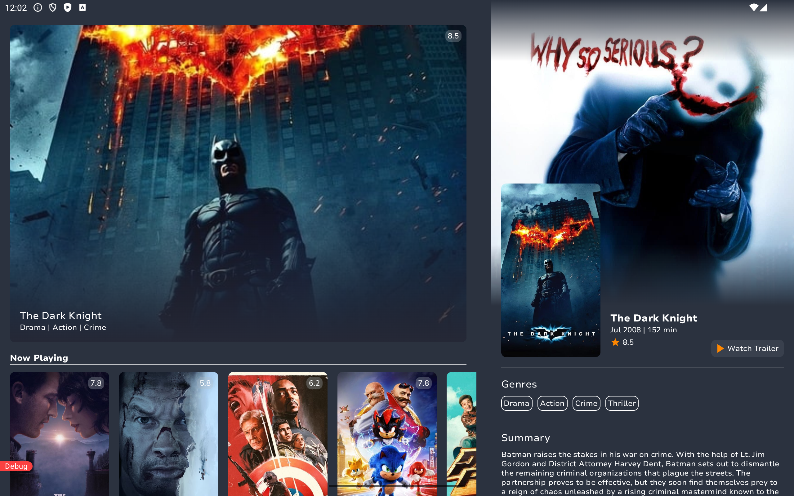

<a name="readme-top"></a>

# MovieCatalog

<p align="center">
  <a href="https://android-arsenal.com/api?level=24" target="_blank"></a>
  <a></a>
  <a></a>
  <a></a>
</p>

<p align="center">
    <a href="https://github.com/enesky/MovieCatalog/blob/develop/.github/workflows/main.yml" target="_blank"></a>
</p>

## Screenshots

<p align="center">
  <a>
    
    
  </a>
</p>

<p align="center">
  <a>
    
    
  </a>
</p>

<p align="center">
  <a>
    
    
  </a>
</p>


<p align="center">
  <a>
    
    
    
  </a>
</p>

## Features


## Configuration
#### Add this to your local.properties in order to use MovieDB API
```properties
# Project specific variables
moviecatalog.api.url="https://api.themoviedb.org/3/"
moviecatalog.api.key="ec4c51244bdef75d9f6f4dcf9dde1ae6"
moviecatalog.image.url="https://image.tmdb.org/t/p/w500"
```

## Module Dependency Graph


## Tech Stack


## Nice to have
[] WIP - Datastore Impl for Cache Mechanism
[] UI Tests using Maestro
[] Benchmark Module and Baseline Profiles
[] Transition animation for HomeScreen to DetailScreen
[] JaCoCo for Code Coverage


<p align="center"><a href="#readme-top"> - Back to top - </a></p>
